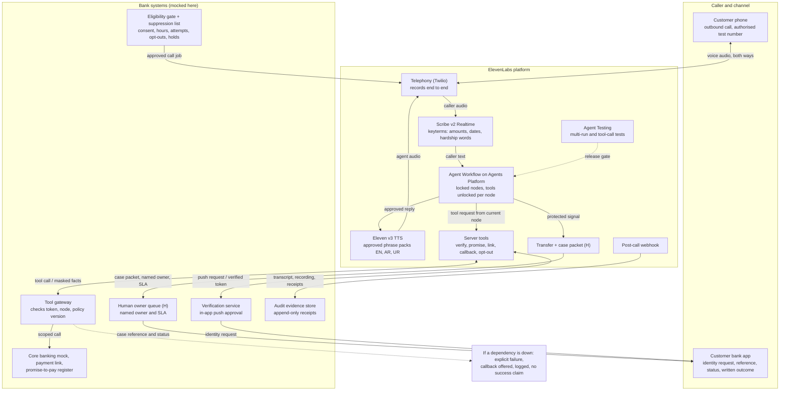

# Architecture

Three zones. The agent never touches a bank system directly: it asks a gateway, and the gateway checks the call token, the workflow node and the policy version before anything happens.



## The closed loop

One escalation writes three things at once, in this order, and the call cannot continue collection until they are done:

1. **Stop.** The workflow moves to a protected node. Collection tools are not in that node's scope, so the agent holds no tool that could take a payment.
2. **Suppress.** `apply_contact_hold` writes to the single suppression list. The bank dialer and the agency file export both read it before dialling.
3. **Own.** `create_human_case` opens a case with a named owner and an SLA from the policy bundle, carrying the transcript, the hardship reason and the customer's own words.

Then the customer sees the same case in the bank app, and the post-call webhook sends the transcript and every receipt to the evidence store.

## Why the state machine, not a prompt

Each node declares its tool scope in the policy bundle:

```js
node_tools: {
  INTRO:     ['write_audit_event', 'register_voice_optout'],
  VERIFY:    ['start_verification', 'get_verification_status', ...],
  DISCLOSE:  ['get_obligation_context', 'get_allowed_promise_dates', ...],
  RESOLVE:   ['record_promise_to_pay', 'create_secure_payment_link', ...],
  PROTECTED: ['apply_contact_hold', 'create_human_case', 'write_audit_event'],
}
```

The gateway refuses anything outside that list. That is why "hardship stops collection" survives a customer arguing, a confusing sentence or a prompt injection: there is no tool to reach for. `tests/run.mjs` proves it (T14, T16).

## Model layer

The prototype classifies intent with keyword matching over English, Arabic and Urdu trigger sets, biased toward escalation: an unmatched sentence is treated as low confidence and handed to a person rather than guessed at (T12). In the build this is Scribe v2 with keyterm biasing plus an LLM constrained by the same workflow, and the escalation triggers stay a policy artefact rather than model behaviour.

## Where ElevenLabs components sit

| Component | Used for |
|---|---|
| Agents Platform, Agent Workflows | The locked nodes and per-node tool scoping above |
| Eleven v3 TTS | Speaking the approved phrase packs in English, Arabic and Urdu |
| Scribe v2 Realtime | Listening, with keyterms for amounts, dates and hardship phrases |
| Server tools | Verification, promise-to-pay, payment link, callback, opt-out, hold, case |
| Telephony (Twilio) | Outbound calls to authorised test numbers, recorded end to end |
| Agent Testing | Multi-run scenarios and tool-call tests before release |
| Post-call webhooks | Sending the transcript and receipts to the evidence store |

Knowledge base and RAG are deliberately excluded: regulated wording comes from approved templates, not retrieval.

## Data

Synthetic customers, reserved test numbers, invented amounts. Nothing here touches a live system, and the prototype keeps no data beyond the browser tab.
